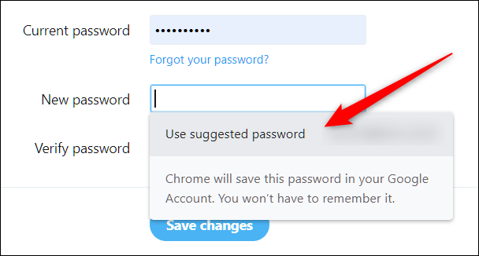

# Password-Generator-With-Python
Building a password generator for a client. The users are required to enter the following data:

- How many letters would you like in your password? 

- How many symbols would you like in your password? 

- How many numbers would you like in your password? 

Based on this data, your program should generate a password that meets the requirements. 

 
Below is an example execution of the program: 

> How many letters would you like in your password? 10 

> How many symbols would you like in your password? 5 

> How many digits would you like in your password? 3 

> Here is your password: YT5]n1]>20~O(.K

The practical example is the "Suggest Password" option that appears when you right click of your mouse when logging into or creating any account.

